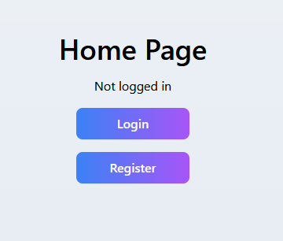
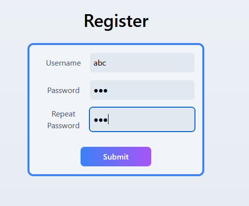
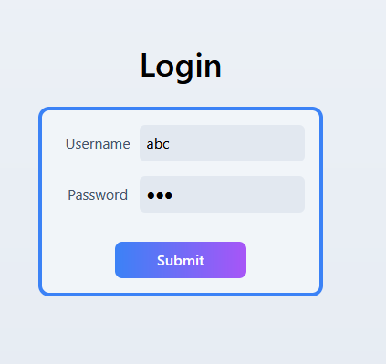
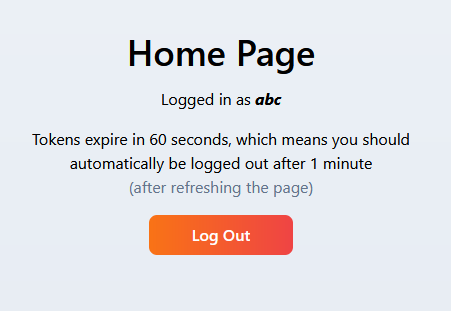

# jwt-login-demo
next.js login demo using JWT

|   |   |
| - | - |
|  |  |
|  |  |

# Running

1. Clone this repo `git clone https://github.com/kvbc/jwt-login-demo`
2. Run `npm i` in `/frontend` and `/backend`
3. Run `npm run dev` in `/frontend` and `/backend` (in separate terminals)
4. Open up `localhost:3000` in your browser
5. Enjoy
